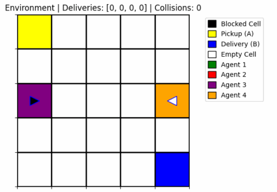

# Multi-Agent GridWorld Simulation using Tabular Q-Learning

## Overview
This project implements a multi-agent GridWorld environment where autonomous agents learn to perform delivery tasks between two fixed points (pickup and delivery) using tabular Q-learning. The simulation includes visualization, collision, handling, delivery tracking and side-by-side comparison of trained vs naive agents.

## Simulation

